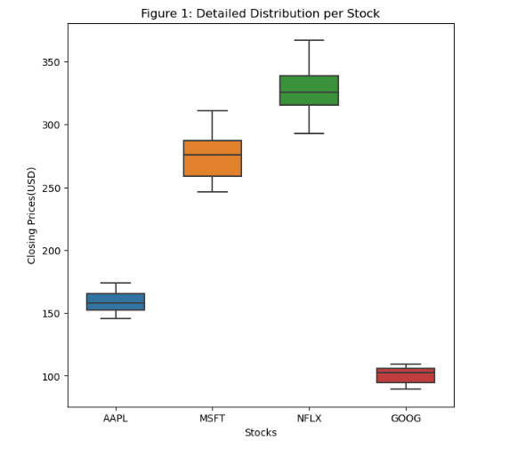
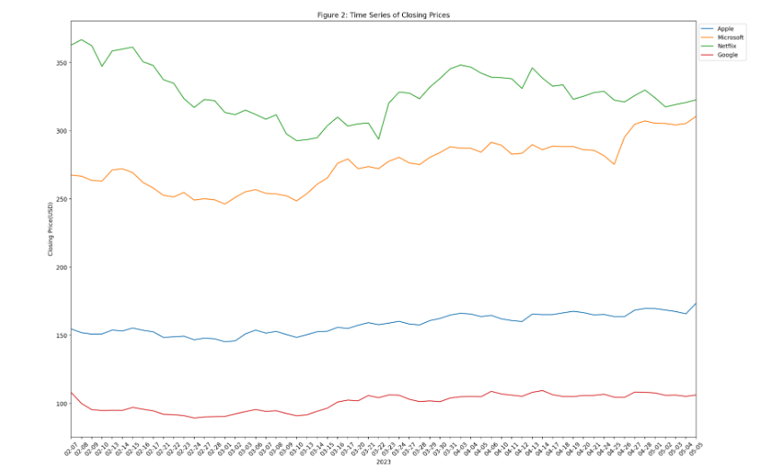
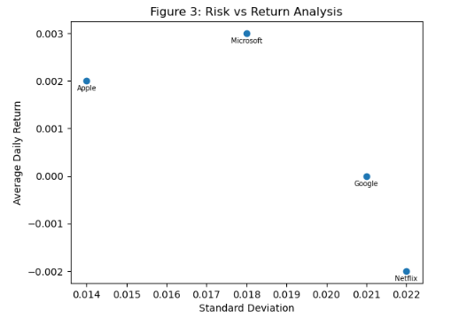
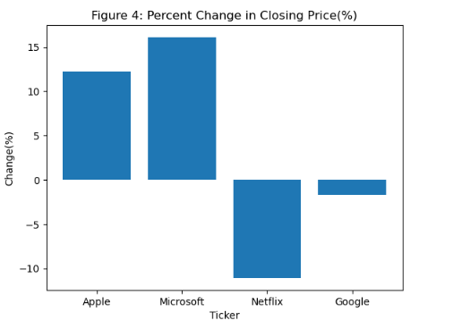
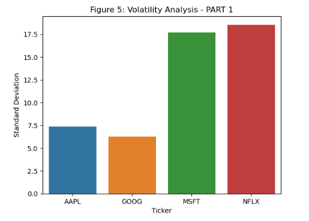
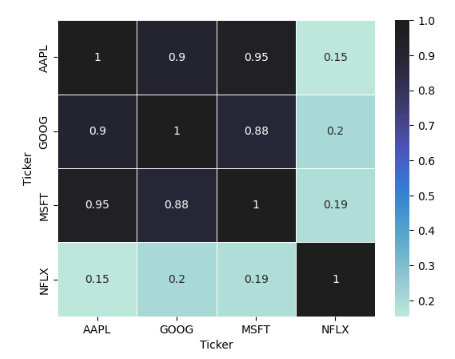

# Stock Market Short vs Long-Term Investment Strategies (AAPL, NFLX, GOOG, MSFT)

With the aid of descriptive statistics, the goal is to firstly gain a deeper understanding of stock market dynamics in order to be able to inform investment strategies from given dataset. 
The specific goals include:

- Trend Analysis: Identifying long-term trends in stock prices and market movements.
- Volatility Assessment: Evaluating the stability and risk associated with different stocks based on their price fluctuations.
- Correlation Study: Investigating how different stocks correlate with each other, understanding market segments and diversification opportunities.
- Risk-Return Trade-off Analysis: Analyzing the balance between the potential risks and rewards of different stocks, aiding in portfolio management

From the above, investment recommendations can be made!

# Barplot & Time-Series Charts

## Summary(1)

- Per Figure 2, both Apple and Microsoft are clearly in a bullish trend. This is observed by the formation of higher lows and a recent break of structure, indicating momentum. Both tickers are forming new highs, suggesting great potential for going long in the near future if a re-test occurs. Choosing between the two would depend on the investment style and risk-taking parameters. Microsoft and Apple would be suitable for short- and long-term returns, respectively. Based on the inter-quartile ranges (Q3-Q1) and ranges (Max - Min), Microsoft shows higher volatility than Apple which makes it ideal for short-term investors, while Apple requires the opposite approach.

- Google shows some great bullish momentum, but for the past two weeks or so, the ticker seems to be stagnating in a range. It is not prudent to take action at this time, especially since the ticker seems to lack volatility at the moment to grasp anyone's attention. It's best to wait for a breakout to confirm the trend direction or to perform additional fundamental analysis on the ticker to gain further insights.

- Netflix's larger range compared to other tickers makes it difficult to predict the current trend. Prices keep fluctuating and revisiting previous highs and lows without bears and bulls taking control. Breakouts have been inconsistent, and my recommendation would be to further perform analysis on a higher timeframe (e.g., Weekly instead of Daily) to have a better picture of what is going on.

Note: All four tickers trade in different price ranges, with AAPL & GOOG and MSFT & NFLX being the closest to each other. MSFT & NFLX trade at higher price levels.

# Risk vs Return Analysis

## Summary(2)

- Out of the 4 tickers, Apple shows great daily return with the least risk potential. This confirms my theory that Apple is the most stable long-term investment out of them all. On the other hand, Microsoft is for sure the best option for short-term investing. Regardless the high volatility, it showed the greatest return. It is undoubtedly a great option for experienced traders that have great risk management skills.  Google and Netflix do not stand out at all and should not be considered rewarding investments. Both showed negative negative daily returns and the highest volatilities. 

# Percent Change in Closing Price (%)

## Summary(3)

- Given that the barplot above measures the total potential profit/loss during the period investigated, Microsoft demonstrated the highest positive change, at approximately 16.10%. Apple displayed a a great positive change of about 12.23%. Google exhibited a slight negative change of approximately -1.69%, suggesting a minor decline in its stock price during the observed period. Lastly, Netflix encountered the most substantial negative change, at approximately -11.07%, indicating a significant decrease in its stock price over the period.

# Volatility Analysis

## Summary(4)
- Figure 5 shows the volatility (measured as standard deviation) of the closing prices for each stock. If sorted for highest to lowest, the order would be as follows: Netflix, Microsoft, Apple, Google. This aligns with the Figures 1 and 2, boxplot and time-series charts, respectively.
- However, using standard deviation to compare volatility is not ideal for tickers that trade in different price levels. In terms of relative variability, GOOG has a higher dispersion from the mean than Netflix and Apple, and is almost the same as Microsoft.

# Correlation Analysis 

## Summary(5)

- The heatmap above shows the correlation amongst all tickers. The correlation coefficient measures the strength and direction of the linear relationship between two variables. 1 indicates a perfect linear relationship. On the other hand, -1 indicates a perfect negative linear relationship. Finally, 0 indicates no linear relationship. From the heatmap, there are no negative linear relationships. There are, however, varying degrees of positive correlations between the stock prices. Apple and Microsoft have the highest coefficient (0.95), and Netflix and Microsoft have the lowest (0.19).

# Conclusion

- The stock analysis reveals notable trends. Apple and Microsoft showcase bullish patterns, offering stability for long-term investors and potential for short-term gains due to volatility, respectively. Google's recent performance shows stagnation, but the ticker had one of the highest coefficient of variation which indicates high volatility overall. Similarly, Netflix's high volatility requires analysis on a higher timeframe for clarity. Microsoft leads in positive price changes, followed by Apple, Google, and Netflix, aligning with volatility rankings. This underscores the importance of considering volatility and trend patterns in investment decisions.
